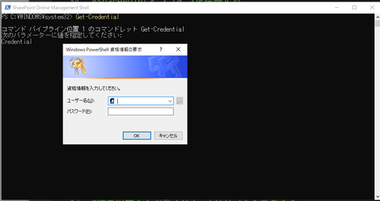
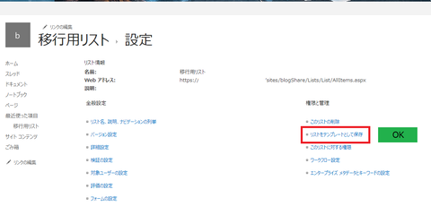

# SharePoint.EnableCustomScript
SharePoint Online Management Shellで特定のサイトのカスタムスクリプト機能を有効にする。（Enable Custom Script in SharePoint Online for a special site using SharePoint Online Management Shell）

## 実施詳細：
1. **SharePoint Online Management Shellをインストールする。**
2. **下記＜＞内の内容を入れ替えてシェルで実行する。**
  - [01.GetCredential.ps1](01.GetCredential.ps1)
  

3. **認証情報を入力した後、下記のコードを実行する。**
- [02.EnableCustomScript.ps1](02.EnableCustomScript.ps1)

## 結果確認：
対象サイトのリストの詳細設定で結果を確認する。 

